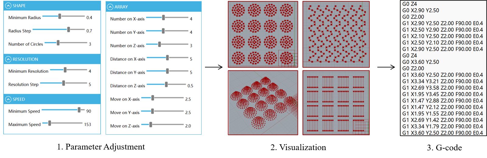
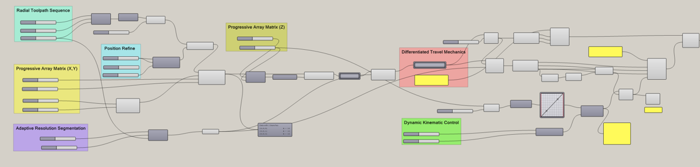

<a name="en"></a>



# 🖨️ Cellink-BIOX G-code Generator

[](README.md)

## 📖 项目简介

欢迎使用 **Cellink-BIOX G-code 生成器**！

本项目基于 **Rhino-Grasshopper** 开发，旨在为 **Cellink-BIOX 生物 3D 打印机**直接生成可执行的定制化 G-code。

本项目支持以下五种基础形状的生成：

- `Cube` — 正方体
- `Cylinder` — 圆柱体
- `Wave` — 波浪
- `Hemisphere` — 半球体
- `Cone` — 圆锥体

通过参数化设计，您可以自由定义打印模型的**尺寸大小、填充密度、正负结构、空间位置以及打印速度**等核心参数。

针对 BIOX 打印机的不同软件版本，本项目专门设计了两套代码，以确保与不同版本的软件兼容。

## ✨ 核心功能

### 📐 5 种参数化几何图形

涵盖正方体、圆柱体、波浪形、半球体和圆锥体五种基础结构，可根据参数生成对应的打印路径。

### ⚙️ 高度可定制

支持自由调节：

- 打印模型尺寸
- 填充密度
- 正结构 / 负结构
- 打印位置
- 打印速度

### 🔄 双版本兼容

项目分别针对 BIOX 打印机软件的不同版本提供了两套 Grasshopper 脚本：

- `gcode/` — 适用于 BIOX 打印机软件版本一
- `gcode2/` — 适用于 BIOX 打印机软件版本二

### 🖥️ 新手友好图形界面

项目提供 `Cylinder_4_posi.gh` 文件，并结合 **Human UI** 插件制作了直观的图形化参数界面。

无需理解复杂的 Grasshopper 节点连接，初学者也可以通过图形化界面调整参数并快速生成 G-code，实现更加直观的参数化操作。

## 📂 仓库结构

```text
📦 Cellink-BIOX-Gcode-Generator
 ┣ 📂 gcode                  # 适用于 BIOX 打印机软件版本一的生成器
 ┃ ┣ 📜 cube.gh
 ┃ ┣ 📜 wave.gh
 ┃ ┣ 📜 hemisphere.gh
 ┃ ┣ 📜 base.gh
 ┃ ┣ 📂 cylinder             # 包含多个历史版本
 ┃ ┗ 📂 cone                 # 包含多个历史版本
 ┣ 📂 gcode2                 # 适用于 BIOX 打印机软件版本二的生成器
 ┃ ┣ 📜 cube.gh
 ┃ ┣ 📜 cylinder.gh
 ┃ ┣ 📜 wave.gh
 ┃ ┣ 📜 hemisphere.gh
 ┃ ┗ 📜 base.gh
 ┣ 📂 images                 # 存放项目相关图片资源
 ┣ 📜 Cylinder_4_posi.gh     # 图形化参数界面，需安装 Human UI 插件
 ┣ 📜 README.md              # 英文说明文档
 ┗ 📜 README_CN.md           # 中文说明文档
````

## ⭕️ 环境要求

* Rhino 8
* Grasshopper
* Xylinus plugin
* Human UI plugin

